Chatbot 만들기 - 튜토리얼
====
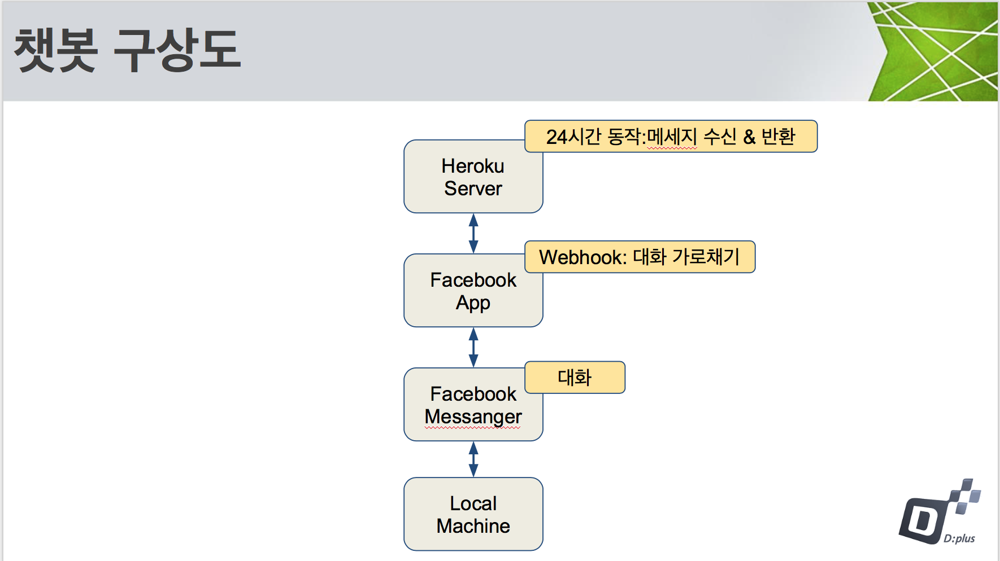

### docker windows버전 설치
[Link](https://docs.docker.com/docker-for-windows/install/#download-docker-for-windows)
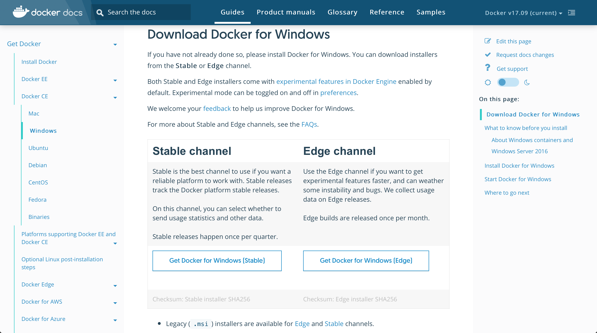

### windows에서 docker 서비스 실행
설치한 docker 아이콘 클릭

### 실행창 열기
`win+R`

### 도스창 열기(관리자 권한으로 실행!)
`cmd`

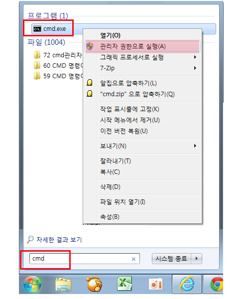

### 미리 세팅되어있는 docker image 다운로드 받기 
`docker pull laftworld/node:Busan`

### (참고) docker image들은 dockerhub에 저장되어 있음
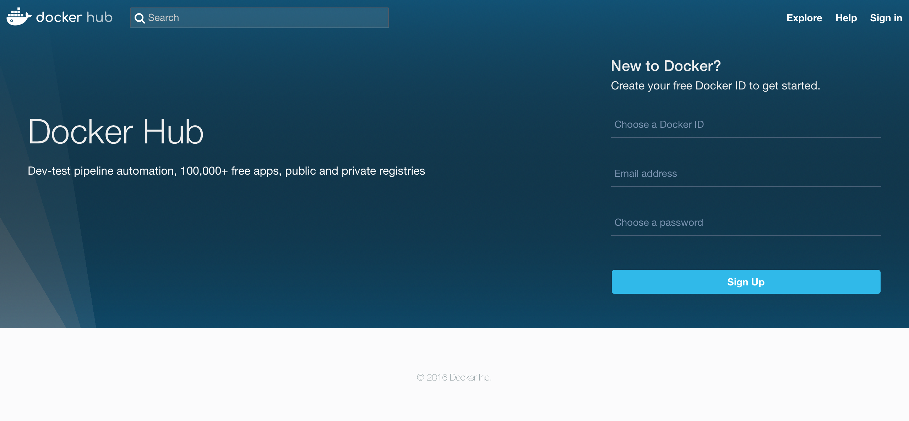

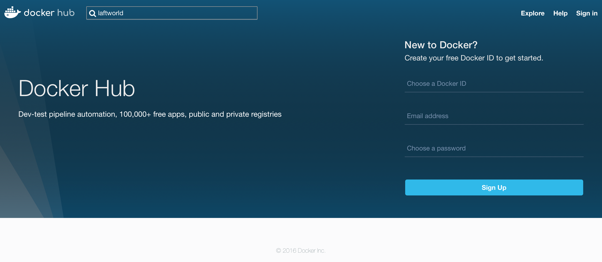

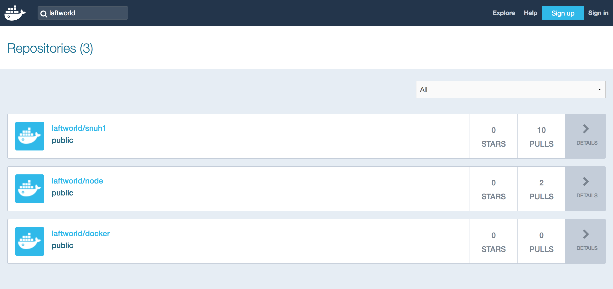

### 다운로드받은 docker image 확인
`docker images`
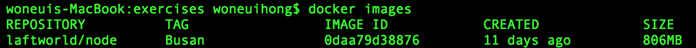

### docker 컨테이너 실행
`docker run -itd laftworld/node:Busan:171221`

### 실행중인 docker 컨테이너 확인
`docker ps -al`
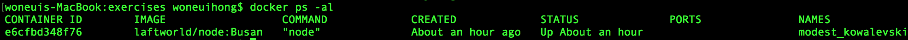

### 실행된 docker 컨테이너 안에 접속
`docker exec -it <<container_name>> /bin/bash`

### 실습용 폴더 안에 들어가기
`cd ~/dev`

### 현재 폴더안의 내용물 확인
`ls`

### 채팅 메세지를 받는 부분 확인
`vim app.js`
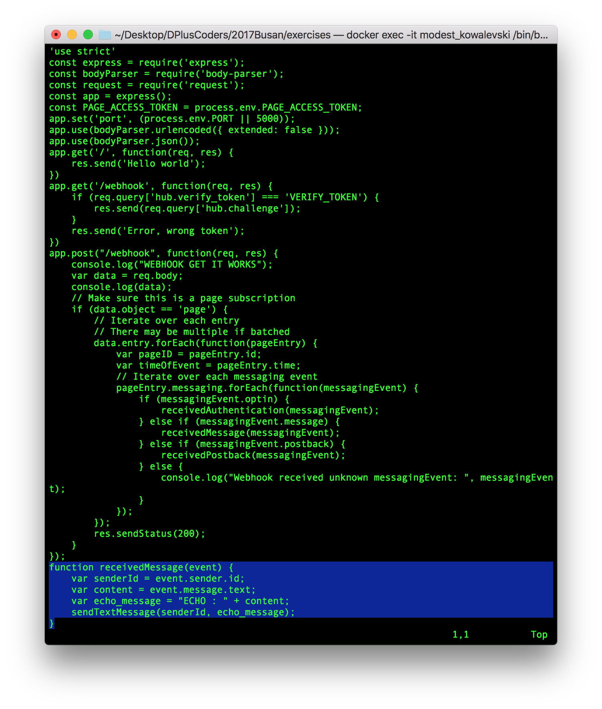
### vim 종료시
`ESC`

`:`

`q`

를 차례로 입력

### heroku 가입
[https://www.heroku.com/](https://www.heroku.com/)
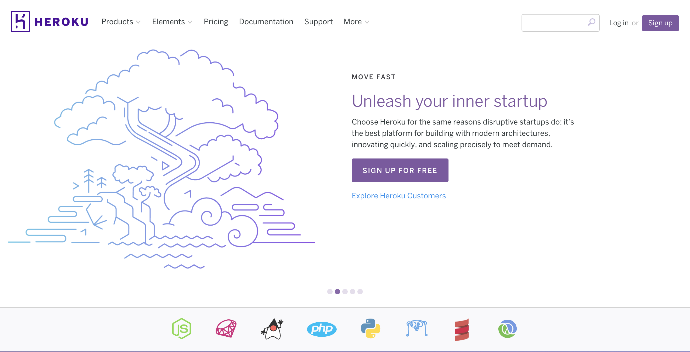

### 실행창에서 heroku 로그인
`heroku login`

(heroku 가입시 입력한 메일주소, P/W 입력)

### git 저장소 초기화
`git init`

`git add .`

`git commit -m 'init'`

### heroku 저장소 만들기
`heroku create`

### 현재 등록되어있는 remote git 저장소 보기
`git remote -v`

### 현재 소스코드를 업로드할 저장소를 설정해줌
`git remote rm heroku`

`git remote add heroku <<heroku git-url>>`

### 현재 소스코드를 heroku 저장소로 업로드(deploy는 자동으로 됨)
`git add .`
`git commit -m "update"`
`git push heroku master`    

### Facebook 가입
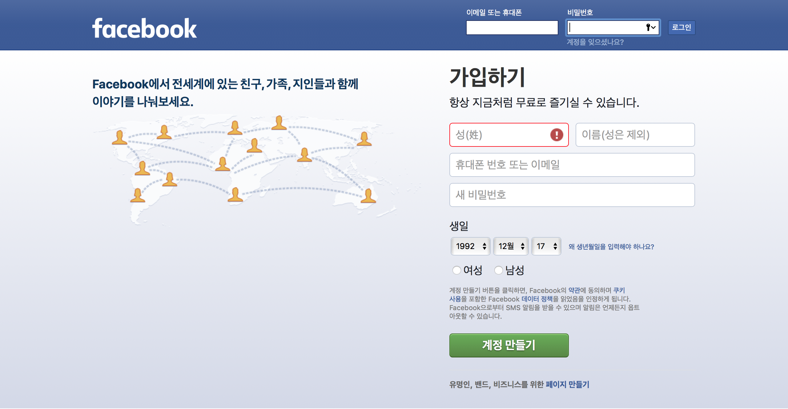

### Facebook 페이지 만들기
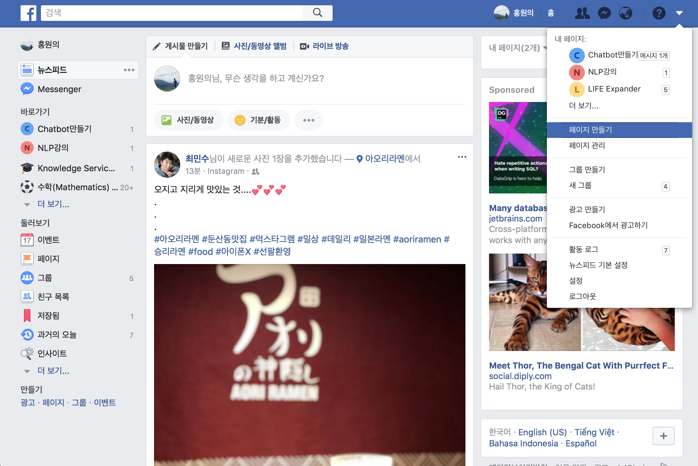

### Facebook App 만들기
[https://developers.facebook.com](https://developers.facebook.com)
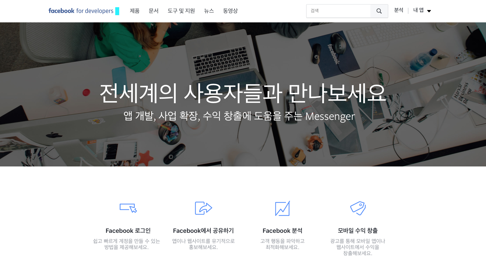

### 페이지 엑세스 토큰 얻기
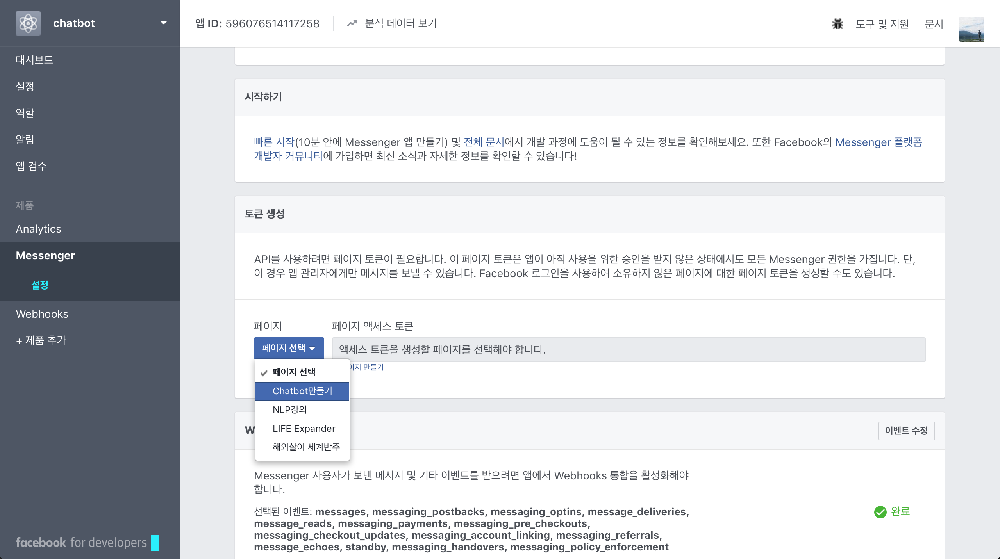

### 페이스북 페이지 구독 설정
    

### Webhooks 설정
- webhook 주소는https://<heroku에 각자 만들어진 DNS 주소>>.herokuapp.com/**webhook/** 
- VERIFY TOKEN에는 'VERIFY_TOKEN' 입력
- 체크박스 모두 체크

- heroku 도메인 주소
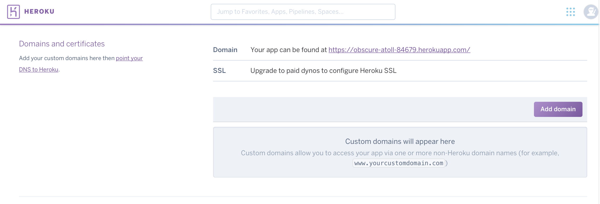

### Reveal Config Vars
- PAGE_ACCESS_TOKEN <<페이스북 앱 페이지 엑세스 토큰 삽입>>
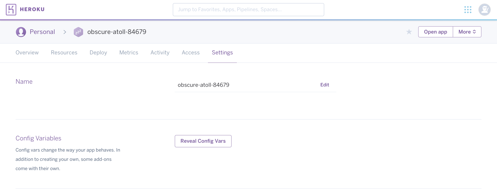

### 페이스북 페이지로 메세지 보내기
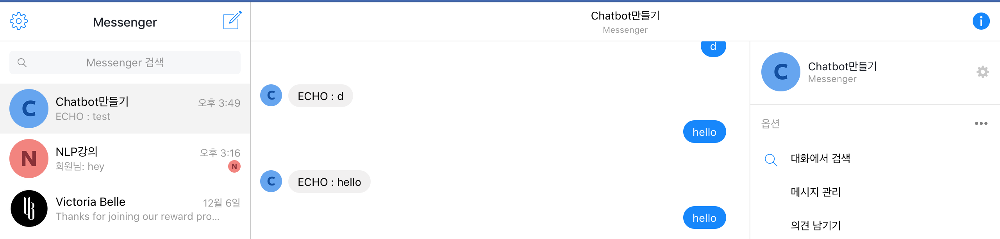

### app.js 수정 후에는 git으로 수정된 파일을 다시 배포
`git add .`

`git commit -m 'chat bot'`

`git push heroku master`

### 작동하는 챗봇 샘플
[Link](https://www.facebook.com/messages/t/307620546399907)

